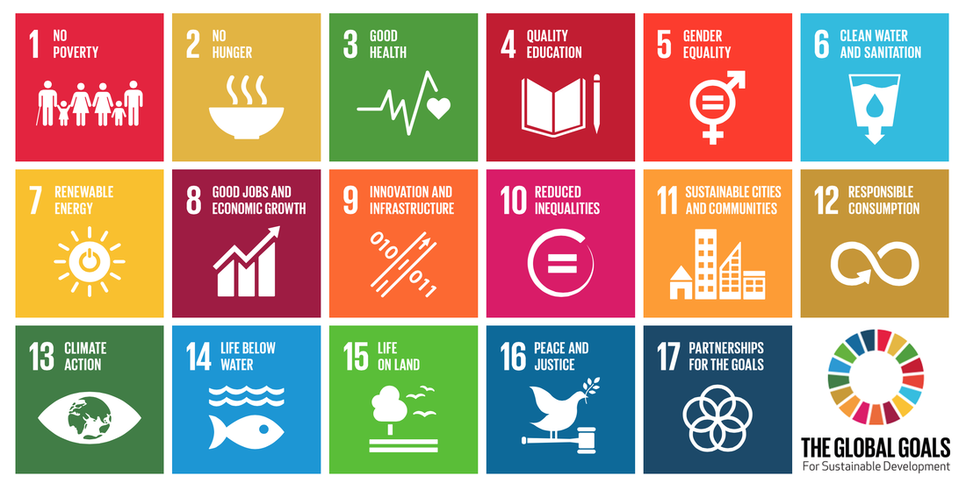

```{r setup, include=FALSE}
knitr::opts_chunk$set(echo = TRUE)
```

## Sustainable Development Goals  


  
What proportion of the targets for each goal are ecological?

### Data

```{r, data, warning=FALSE, message=FALSE}
library(tidyverse)
data <- read_csv("data/goals_targets.csv")

count.data <-  data %>%
  group_by(item, discipline) %>%
  summarise(n = n())

ggplot(count.data, aes(item, n, fill = discipline)) +
  geom_bar(stat = "identity")

library(skimr)
skim(count.data)
```
